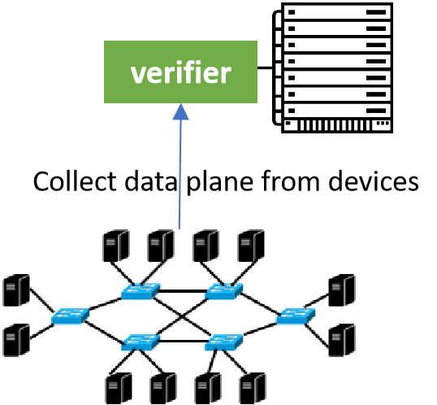

There has been a long line of research on both data plane verification (DPV) and control plane verification (CPV). In this work, we mainly focus on data plane verification, because data plane is the ground truth of network, in other words,  it can detect a wider range of network errors by checking the actual data plane at the network devices. However, current data plane verification tools employ a centralized architecture, where a server collects the data planes of all devices and verifies them.  This design faces scalability issues in large networks, such as maintaining a reliable, low-latency management network, performance bottleneck and single point of failure. 

In this article, we propose Coral, a distributed, on-device DPV framework, to tackle the scalability challenge of DPV, allowing to achieve scalable DPV under various settings, with little overhead on commodity network devices.

## Issues of centralized DPV

Existing tools use a centralized architecture, which lacks the scalability needed for deployment in large networks. Specifically, they use a centralized server to collect the data plane from each network device and verify the requirement. Such a design is unscalable in nature: (1) it requires a management network to provide reliable connections between the server and network devices, which is hard to build itself; (2) it introduces a long control path, which includes sending device data planes to the server, performing verification at the server, and sending corresponding action instructions from the server back to devices, leading to the slow response to network errors and finally affecting network availability; (3) the server becomes the performance bottleneck and the single point of failure of DPV tools, it is mainly because larger network requires verifiers with stronger operational capability. To scale up DPV, Libra [[1]](#Libra) partitions the data plane into disjoint packet spaces and uses MapReduce to achieve parallel verification in a cluster; Azure RCDC [[2]](#RCDC) partitions the data plane by device to verify the availability of all shortest paths with a higher level of parallelization in a cluster. However, both are still centralized designs with the limitations above, and RCDC can only verify that particular requirement.

## The challenges of scaling DPV via distributed

As shown above, there is a huge shortcoming in scalability for centralized DPV tools when facing large networks. To this end,  we embrace a distributed design to circumvent the inherent scalability bottleneck of centralized design. Unfortunately, the choice of scaling DPV via distributed, on-device computation comes with challenges below:

* How to specify the requirements to check? Most DPV tools only check a fixed set of requirements (e.g., reachability, loop-free and blackhole-free).
* How to make the on-device tasks lightweight? Switches or routers have low-end CPU, and already run multiple protocols (e.g., SNMP, OSPF and BGP).
* How to make devices exchange results correctly and efficiently? Distributed computing has its own issues (e.g., safety, liveness and consistency).

## Design(TBD)

**A declarative requirement specification language. **

This language abstracts a requirement as a tuple of packet space, ingress devices and behavior, where a behavior is a predicate on whether the paths of packets match a pattern specified in a regular expression. This design allows operators to flexibly specify common requirements studied by existing DPV tools (*e.g.*, reachability, blackhole free, waypoint and isolation), and more advanced, yet understudied requirements (*e.g.*, multicast, anycast, no-redundant-delivery and all-shortest-path availability).

**A verification planner .** Given a requirement, the planner decides the tasks to be executed on devices to verify it. The core challenge is how to make these tasks lightweight, because commodity network devices have little computation power to spare. To this end, the planner first uses the requirement

and the network topology to compute a novel data structure called *DVNet*, a DAG compactly representing all paths in the network that satisfies the path patterns in the requirement. It then transforms the DPV problem into a counting problem on *DVNet*. The latter can be solved by a reverse topological

traversal along *DVNet*. In its turn, each node in *DVNet* takes as input the data plane of its corresponding device and the counting results of its downstream nodes to compute for different packets, how many copies of them can be delivered to the intended destinations along downstream paths in *DVNet*. This traversal can be naturally decomposed into on-device counting tasks, one for each node in *DVNet*, and distributed to the corresponding network devices by the planner. We design optimizations to compute the minimal counting information of each node in *DVNet* to send to its upstream neighbors, and prove that for requirements such as all-shortest-path availability, their minimal counting information is an empty set, *i.e.*, the local contracts in RCDC [39] is a special case of Coral.

**On-device verifiers equipped with a DVM protocol.** On-device verifiers execute the on-device counting tasks specified by the planner and share their results with neighbor devices to collaboratively verify the requirements. In particular, we are inspired by vector-based routing protocols [53, 54] to design a DVM protocol that specifies how neighboring on device verifiers communicate counting results in an efficient, correct way.

## Example 

To demonstrate the basic workflow of Coral, let's take a look at a concrete example. We consider the network in the following picture and the requirement: all packets entering the network from S with a destination IP in 10.0.0.0/23 must be delivered to D via a simple path passing W.

* Requirement Specification 

Firstly,the operater use a declarative language to specify verification requirements. The program of the example requirement is described as:
(dstIP = 10.0.0.0/23, [S], S .* W .* D and loop_free, "exist >=1")
,where loop_free is a shortcut in the language for a regular expression that accepts no path with a loop. It specifies that when any p destined to 10.0.0.0/23 enters from S, at least 1 copy of it will be delivered to D along a simple path waypointing W.

Given a requirement, the Coral planner employs a data structure called DVNet to decompose the DPV problem into small on-device verification tasks, and distribute them to on-device verifiers for distributed execution. From requirement and topology to DVNet. The planner first leverages the automata theory [[8]](#automata-theory) to take the product of the regular expression path_exp in the requirement and the topology, and get a DAG called DVNet. A DVNet compactly represents all paths in the topology that match the pattern path_exp.The following picture gives the computed DVNet in our example. 

Note the devices in the network and the nodes in DVNet have a 1-to-many mapping. For each node u in DVNet, we assign a unique identifier, which is a concatenation of u.dev and an integer. For example, device C in the network is mapped to two nodes C1 and C2 in DVNet, because the regular expression allows packets to reach D via [C,W,D] or [W,C,D].

## Summary

Current DPV tools employ a centralized architecture, however, this design faces scalability issues in large networks, such as maintaining a reliable, low-latency management network, performance bottleneck, and single point of failure. To tackle the scalability challenge of DPV, we design Coral, a distributed DPV framework to achieve scalable DPV by decomposing verification to lightweight on-device counting tasks. Coral consists of (1) a declarative specification language,(2) a verification planner decomposing global verification into lightweight on-device counting tasks, and (3) a distributed verification messaging(DVM) protocol that enables efficient and distributed computing among on-device verifiers. Extensive experiments demonstrate the benefits and feasibility of Coral. 
		
There's a lot more to learn about this topic, and in future blog posts, we will explore some of them. (1)Some studies investigate the verification of stateful DP (e.g., middleboxes)[[3]](#middleboxes) and programmable DP (e.g., P4 [[4]](#P4) ) . Studying how to extend Coral to verify stateful and programmable DP would be an interesting future work. (2) Coral chooses BDD [[5]](#BDD) to represent packets for its efficiency. Recent data structures (e.g.,ddNF [[6]](#ddNF) and PEC [[7]](#PEC)) may have better performance and benefit Coral. We leave this as future work.

## References

 [1] H. Zeng, S. Zhang, F. Ye, V. Jeyakumar, M. Ju, J. Liu, N. McKeown, and A. Vahdat. Libra: Divide and conquer to verify forwarding tables in huge networks. In 11th USENIX Symposium on Networked Systems Design and Implementation (NSDI), pages 87–99, 2014.

[2] K. Jayaraman, N. Bjørner, J. Padhye, A. Agrawal, A. Bhargava, P.-A. C. Bissonnette, S. Foster, A. Helwer, M. Kasten, I. Lee, et al.
Validating datacenters at scale. In Proceedings of the ACM Special Interest Group on Data Communication, pages 200–213. 2019.

[3] Aurojit Panda, Ori Lahav, Katerina Argyraki, Mooly Sagiv, and Scott Shenker. Verifying reachability in networks with mutable datapaths. In 14th USENIX symposium on networked systems design and implementation(NSDI), pages 699–718, 2017.
		
[4] Pat Bosshart, Dan Daly, Glen Gibb, Martin Izzard, NickMcKeown, Jennifer Rexford, Cole Schlesinger, Dan Talayco, Amin Vahdat, George Varghese, et al. P4:Programming protocol-independent packet processors.ACM SIGCOMM Computer Communication Review,44(3):87–95, 2014.
		
[5] Randal E Bryant. Graph-based algorithms for boolean function manipulation. Computers, IEEE Transactions on, 100(8):677–691, 1986.
		
[6] Nikolaj Bjørner, Garvit Juniwal, Ratul Mahajan, Sanjit A Seshia, and George Varghese. Ddnf: An efficient data structure for header spaces. In Haifa Verification Conference, pages 49–64. Springer, 2016.
		
[7] Alex Horn, Ali Kheradmand, and Mukul R Prasad. A precise and expressive lattice-theoretical framework for efficient network verification. In 2019 IEEE 27th In- ternational Conference on Network Protocols (ICNP),pages 1–12. IEEE, 2019.

[8] Harry R Lewis and Christos H Papadimitriou. Elements of the theory of computation. ACM SIGACT News, 29(3):62–78, 1998.

