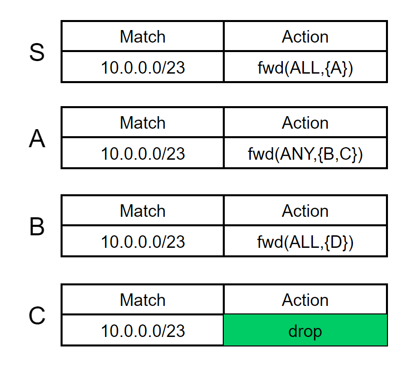

There has been a long line of research on both data plane verification (DPV) and control plane verification (CPV). In this work, we mainly focus on data plane verification, because data plane is the ground truth of network, in other words,  it can detect a wider range of network errors by checking the actual data plane at the network devices. However, current data plane verification tools employ a centralized architecture, where a server collects the data planes of all devices and verifies them.  This design faces scalability issues in large networks, such as maintaining a reliable, low-latency management network, performance bottleneck and single point of failure. 

In this article, we propose Coral, a distributed, on-device DPV framework, to tackle the scalability challenge of DPV, allowing to achieve scalable DPV under various settings, with little overhead on commodity network devices.

## Issues of centralized DPV

Existing tools use a centralized architecture, which lacks the scalability needed for deployment in large networks. Specifically, they use a centralized server to collect the data plane from each network device and verify the requirement. Such a design is unscalable in nature: (1) it requires a management network to provide reliable connections between the server and network devices, which is hard to build itself; (2) it introduces a long control path, which includes sending device data planes to the server, performing verification at the server, and sending corresponding action instructions from the server back to devices, leading to the slow response to network errors and finally affecting network availability; (3) the server becomes the performance bottleneck and the single point of failure of DPV tools, it is mainly because larger network requires verifiers with stronger operational capability. To scale up DPV, Libra [[1]](#Libra) partitions the data plane into disjoint packet spaces and uses MapReduce to achieve parallel verification in a cluster; Azure RCDC [[2]](#RCDC) partitions the data plane by device to verify the availability of all shortest paths with a higher level of parallelization in a cluster. However, both are still centralized designs with the limitations above, and RCDC can only verify that particular requirement.

## The challenges of scaling DPV via distributed

As shown above, there is a huge shortcoming in scalability for centralized DPV tools when facing large networks. To this end,  we embrace a distributed design to circumvent the inherent scalability bottleneck of centralized design. Unfortunately, the choice of scaling DPV via distributed, on-device computation comes with challenges below:

* How to specify the requirements to check? Most DPV tools only check a fixed set of requirements (e.g., reachability, loop-free and blackhole-free).
* How to make the on-device tasks lightweight? Switches or routers have low-end CPU, and already run multiple protocols (e.g., SNMP, OSPF and BGP).
* How to make devices exchange results correctly and efficiently? Distributed computing has its own issues (e.g., safety, liveness and consistency).

## Basic design

**A declarative requirement specification language.** Operators specify verification requirements using a declarative language. A requirement is specified as a (packet_space, ingress_set, behavior) tuple. The semantic means: for each packet p in packet_space entering the network from any device in ingress_set, the traces of p in all its universes must satisfy the constraint specified in behavior, which is specified as a tuple of a regular expression of valid paths path_exp and a match operator. To specify behaviors, we use the building block of (match_op, path_exp) entries. The basic syntax provides two match_op operators. One is exist count_exp, which requires that in each universe, the number of traces matching path_exp (a regular expression over the set of devices) satisfies count_exp. The other operator is equal, which specifies an equivalence behavior: the union of universes for each p in pkt_space from each ingress in ingress_set must be equal to the set of all possible paths that match path_exp. Finally, behaviors can also be specified as conjunctions, disjunctions, and negations of these (match_opi, path_exp) pairs.

**A verification planner .** Given a requirement, the planner decides the tasks to be executed on devices to verify it. It first uses the requirement and the network topology to compute a novel data structure called *DVNet*, a DAG compactly representing all paths in the network that satisfies the path patterns in the requirement. It then transforms the DPV problem into a counting problem on *DVNet*. The latter can be solved by a reverse topological traversal along *DVNet*. In its turn, each node in *DVNet* takes as input the data plane of its corresponding device and the counting results of its downstream nodes to compute for different packets, how many copies of them can be delivered to the intended destinations along downstream paths in *DVNet*. This traversal can be naturally decomposed into on-device counting tasks, one for each node in *DVNet*, and distributed to the corresponding network devices by the planner. We design optimizations to compute the minimal counting information of each node in *DVNet* to send to its upstream neighbors, and prove that for requirements such as all-shortest-path availability, their minimal counting information is an empty set, *i.e.*, the local contracts in RCDC is a special case of Coral.

**On-device verifiers equipped with a DVM protocol.**  The DVM protocol specifies how on-device verifiers share their counting results with neighbors in an efficient, correct way, to collaboratively verify a requirement.  Given a device *X*, its on-device verififier stores two types of information: (1) a table of local equivalence classes (LECs), where an LEC is a set of packets whose actions are identical at *X*; and (2) a counting information base (CIB), a table of (*packet space, count*) mapping of each *X.node* in *DVNet*. Devices share their CIB with the devices of upstream neighbors following the opposite direction of links in *DVNet*, using UPDATE messages. Given device *X*, when it receives an UPDATE message or its own data plane is updated (*e.g.*, a forwarding rule insertion), *X* updates its own CIB with the latest downstream counting results and the data plane in this message, and sends only the delta (*i.e.*, the changed (*packet space, count*) mapping) to its upstream neighbors. If *X* has an internal event (*e.g.*, rule update or link down), it is handled in a similar way.

## Example 

To demonstrate the basic workflow of Coral, let's take a look at a concrete example. We consider the network in the following picture and the requirement: all packets entering the network from S with a destination IP in 10.0.0.0/23 must be delivered to D via a simple path passing W.

* Requirement Specification 

The example requirement is described as:

(dstIP = 10.0.0.0/23, [S], S .* W .* D and loop_free, "exist >=1") 

using our declarative requirement specification language, where loop_free is a shortcut in the language for a regular expression that accepts no path with a loop. It specifies that when any p destined to 10.0.0.0/23 enters from S, at least 1 copy of it will be delivered to D along a simple path waypointing W.

The network data plane is described as follows:

* From Requirement and Topology to DVNet

Given a requirement, the Coral planner then employs a DVNet to decompose the DPV problem into small on-device verification tasks, and distribute them to on-device verifiers for distributed execution. The planner first leverages the automata theory [[8]](#automata-theory) to take the product of the regular expression path_exp in the requirement and the topology, and get a DVNet. The following picture gives the computed DVNet in our example. 

Note the devices in the network and the nodes in DVNet have a 1-to-many mapping. For each node u in DVNet, we assign a unique identifier, which is a concatenation of u.dev and an integer. For example, device C in the network is mapped to two nodes C1 and C2 in DVNet, because the regular expression allows packets to reach D via [C,W,D] or [W,C,D].

* From Verification in Network to Counting in DVNet

Each node u takes as input (1) the data plane of u.dev and (2) for different p in packet_space, the number of copies that can be delivered from each of u’s downstream neighbors to the destination, along DVNet, by the network data plane, to compute the number of copies that can be delivered from u to the destination along DVNet by the network data plane. In the end, the source node of DVNet computes the final result of the counting problem.The following picture illustrates the algorithm:

For simplicity, we use P1,P2,P3 to represent the packet spaces with destination IP prefixes of 10.0.0.0/23, 10.0.0.0/24, and 10.0.1.0/24, respectively.Each u in DVNet initializes a packet space → count mapping, (P1,0), except for D1 that initializes the mapping as (P1,1) (i.e., one copy of any packet in P1 will be sent to the correct external ports). Afterwards, we traverse all the nodes in DVNet in reverse topological order to update their mappings. Each node u checks the data plane of u.dev to find the set of next-hop devices u.dev will forward P1 to. If the action of forwarding to this next-hop set is of ALL-type, the mapping at u can be updated by adding up the count of all downstream neighbors of u whose corresponding device belongs to the set of next-hops of u.dev for forwarding P1. For example, node C1 updates its mapping to (P1,1) because device C forwards to D, but node W2’s mapping is still (P1,0) because W does not forward P1 to D. Similarly, although W1 has two downstream neighbors C1 an D1, each with an updated mapping (P1,1). In its turn, we update its mapping to (P1,1) instead of (P1,2), because device W only forwards P1 to C, not D. In the end, the updated mapping of S1 [(P2, [0,1]), (P3,1)] reflects the final counting results, indicating that the data plane does not satisfy the requirements  in all universes. In other words, the network data plane is erroneous.

* Distributed, Event-Driven, Verification using DVM Protocol

Consider a scenario, where B updates its data plane to forward P1 to W, instead of to C. The data plane will be updated to：

The update process is as follows:

In this case, device B locally updates the task results of B1 and B2 to [(P1,1)] and [(P1,0)], respectively, and sends corresponding updates to the devices of their upstream neighbors, i.e., [(P1,1)] sent to A following the opposite of (A1,B1) and [(P1,0)] sent to W following the opposite of (W3,B2). Upon receiving the update, W does not need to update its mapping for node W3, because W does not forward any packet to B. As such, W does not need to send any update to A along the opposite of (A1,W3). In contrast, A needs to update its task result for node A1 to [(P1,1)] because (1) no matter whether A forwards packets in P2 to B or W, 1 copy of each packet will be sent to D, and (2) P2 ∪P3 = P1. After updating its local result, A sends the update to S along the opposite of (S1,A1). Finally, S updates its local result for S1 to [(P1,1)], i.e., the requirement is satisfied after the update.

## Summary

Current DPV tools employ a centralized architecture, however, this design faces scalability issues in large networks. To tackle the scalability challenge of DPV, we design Coral, a distributed DPV framework to achieve scalable DPV by decomposing verification to lightweight on-device counting tasks. Coral consists of (1) a declarative specification language,(2) a verification planner decomposing global verification into lightweight on-device counting tasks, and (3) a distributed verification messaging(DVM) protocol that enables efficient and distributed computing among on-device verifiers. 

There's a lot more to learn about this topic, and in future blog posts, we will explore some of them. (1)Some studies investigate the verification of stateful DP (e.g., middleboxes)[[3]](#middleboxes) and programmable DP (e.g., P4 [[4]](#P4) ) . Studying how to extend Coral to verify stateful and programmable DP would be an interesting future work. (2) Coral chooses BDD [[5]](#BDD) to represent packets for its efficiency. Recent data structures (e.g.,ddNF [[6]](#ddNF) and PEC [[7]](#PEC)) may have better performance and benefit Coral. We leave this as future work.

## References

 [1] H. Zeng, S. Zhang, F. Ye, V. Jeyakumar, M. Ju, J. Liu, N. McKeown, and A. Vahdat. Libra: Divide and conquer to verify forwarding tables in huge networks. In 11th USENIX Symposium on Networked Systems Design and Implementation (NSDI), pages 87–99, 2014.

[2] K. Jayaraman, N. Bjørner, J. Padhye, A. Agrawal, A. Bhargava, P.-A. C. Bissonnette, S. Foster, A. Helwer, M. Kasten, I. Lee, et al. Validating datacenters at scale. In Proceedings of the ACM Special Interest Group on Data Communication, pages 200–213. 2019.

[3] Aurojit Panda, Ori Lahav, Katerina Argyraki, Mooly Sagiv, and Scott Shenker. Verifying reachability in networks with mutable datapaths. In 14th USENIX symposium on networked systems design and implementation(NSDI), pages 699–718, 2017.
		
[4] Pat Bosshart, Dan Daly, Glen Gibb, Martin Izzard, NickMcKeown, Jennifer Rexford, Cole Schlesinger, Dan Talayco, Amin Vahdat, George Varghese, et al. P4:Programming protocol-independent packet processors.ACM SIGCOMM Computer Communication Review,44(3):87–95, 2014.
		
[5] Randal E Bryant. Graph-based algorithms for boolean function manipulation. Computers, IEEE Transactions on, 100(8):677–691, 1986.
		
[6] Nikolaj Bjørner, Garvit Juniwal, Ratul Mahajan, Sanjit A Seshia, and George Varghese. Ddnf: An efficient data structure for header spaces. In Haifa Verification Conference, pages 49–64. Springer, 2016.
		
[7] Alex Horn, Ali Kheradmand, and Mukul R Prasad. A precise and expressive lattice-theoretical framework for efficient network verification. In 2019 IEEE 27th In- ternational Conference on Network Protocols (ICNP),pages 1–12. IEEE, 2019.

[8] Harry R Lewis and Christos H Papadimitriou. Elements of the theory of computation. ACM SIGACT News, 29(3):62–78, 1998.

