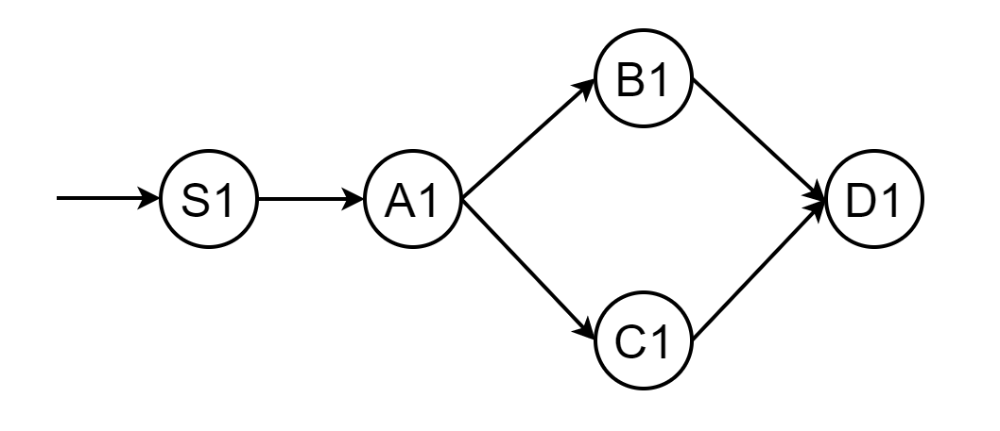

Unlike control plane verification, data plane is the ground truth of network, in other words,  it can detect a wider range of network errors by checking the actual data plane at the network devices. We highly appraise the performance of state-of-art data plane verification tool (e.g., APkeep) that can  achieve incremental verification times of tens of microseconds per rule update. However, current data plane verification tools employ a centralized architecture, where a server collects the data planes of all devices and verifies them.  This design faces scalability issues in large networks, such as maintaining a reliable, low-latency management network, performance bottleneck and single point of failure. As a result, to squeeze incremental performance improvements out of centralized DPV, researchers may pay a huge amount of time and money on validation algorithm and a cluster of verifiers with stronger operational capability.

In this article, we propose a distributed, on-device DPV framework named Coral to tackle the scalability challenge of DPV, allowing to achieve scalable DPV under various settings, with little overhead on commodity network devices.

## Issues of centralized DPV architecture

Existing tools use a centralized architecture, which lacks the scalability needed for deployment in large networks. Specifically, they use a centralized server to collect the data plane from each network device and verify the requirement. Such a design is unscalable in nature:

* It requires a management network to provide reliable connections between the server and network devices, which is hard to build itself; 
* It introduces a long control path, which includes sending device data planes to the server, performing verification at the server, and sending corresponding action instructions from the server back to devices, leading to the slow response to network errors and finally affecting network availability;
* The server becomes the performance bottleneck and the single point of failure of DPV tools, it is mainly because larger network requires verifiers with stronger operational capability. 

Our work is inspired by Azure RCDC [[1]](#RCDC). Though it is still centralized design, it takes the first step  by partitioning verification into local contracts of devices. To be specific, it gives an interesting analogy between such local contracts and program verification using annotation with inductive loop invariants, but stops at designing communication-free local contracts for the particular all-shortest-path availability requirement and validating them in parallel on a centralized cluster.

## Pros&cons of scaling DPV via distributed, on-device computation

As shown above, there is a huge shortcoming in scalability for centralized DPV tools when facing large networks. To this end,  we embrace a distributed design to circumvent the inherent scalability bottleneck of centralized design. Obviously, there are huge benefits using this kind of architecture: 

* It provides with robust, distributed network behavior checking. Just like configuring routing protocols, network devices could verify the task automatically once being configured. We only have to re-configure devices when update the validation task.
* There is no performance bottleneck for distributed, on-device computation because more network devices means more on-device verifiers.
* There won't have single point of failure, because a network device is accompanied with an on-device verifier.  When a network device faces malfunction, a on-device verifier will report a network error accordingly.
* Since we apply on-device computation, there is no need to send data plane information and the corresponding result through the management network and thus provide with rapid response to verification tasks.

Unfortunately, the choice of scaling DPV via distributed, on-device computation comes with challenges below:

* How to specify the requirements to check? Most DPV tools only check a fixed set of requirements (e.g., reachability, loop-free and blackhole-free);
* How to make the on-device tasks lightweight? Switches or routers have low-end CPU, and already run multiple protocols (e.g., SNMP, OSPF and BGP);
* How to make devices exchange results correctly and efficiently? Distributed computing has its own issues (e.g., safety, liveness and consistency).

## Basic design

The key insight of Coral is DPV can be transformed into a counting problem on a directed acyclic graph, which can be naturally decomposed into lightweight tasks executed at network devices, enabling fast data plane checking in networks of various types and scales. Figure below gives the architecture and basic workflow of Coral.

Operators first specify the verification requirement which contains a tuple of packet space, ingress devices and behavior. This design allows us to flexibly express common requirements like reachability, blackhole free, waypoint, and more advanced, yet understudied requirements (*e.g.*, multicast, anycast, no-redundant-delivery and all-shortest-path availability). Coral then takes as input the verification requirement and the network topology to compute a DVNet,  which compactly representing all paths in the network that satisfies the path patterns in the requirement. In this turn, a  DPV problem is transformed into a counting problem on DVNet. In dealing with the counting problem, , each node in DVNet uses the data plane of its corresponding device and the counting results of its downstream nodes to compute for different packets, how many copies of them can be delivered to the intended destinations along downstream paths in DVNet. This traversal can be naturally decomposed into on-device counting tasks, one for each node in DVNet, and distributed to the corresponding network devices by the planner. And finally, on-device verifiers execute the on-device counting tasks specified by the planner and share their results with neighbor devices based on the DV protocol to collaboratively verify the requirements. 

Coral consistently achieves scalable DPV under various networks and DPV scenarios, i.e., verifying a real, large DC in less than 41 seconds while other tools need several minutes or even tens of hours, and up to 2354× speed up on 80% quantile of incremental verification, with little overhead on commodity network devices.

## Example 

To demonstrate the basic workflow of Coral, let's take a look at a concrete example. We consider the network in the following picture and the requirement: all packets entering the network from S with a destination IP in 10.0.0.0/23 must be delivered to D via a simple path passing C.

* Requirement Specification 

The example requirement is described as:

(dstIP = 10.0.0.0/23, [S], S.* C.* D and loop_free, "exist >=1") 

using our declarative requirement specification language, where loop_free is a shortcut in the language for a regular expression that accepts no path with a loop. It specifies that when any p destined to 10.0.0.0/23 enters from S, at least 1 copy of it will be delivered to D along a simple path waypointing C.

The network data plane is described as follows:

* From Requirement and Topology to DVNet

Given a requirement, the Coral planner then employs a DVNet to decompose the DPV problem into small on-device verification tasks, and distribute them to on-device verifiers for distributed execution. The planner first leverages the automata theory [[2]](#automata-theory) to take the product of the regular expression path_exp in the requirement and the topology, and get a DVNet. The following picture gives the computed DVNet in our example. 

* From Verification in Network to Counting in DVNet

Each node u takes as input (1) the data plane of u.dev and (2) for different p in packet_space, the number of copies that can be delivered from each of u’s downstream neighbors to the destination, along DVNet, by the network data plane, to compute the number of copies that can be delivered from u to the destination along DVNet by the network data plane. In the end, the source node of DVNet computes the final result of the counting problem.The following picture illustrates the algorithm:

In the end, the updated mapping of S1[P,1] reflects the final counting results, indicating that the data plane satisfies the requirements in all universes. In other words, the network data plane is correct.

* Distributed, Event-Driven, Verification using DVM Protocol

Consider a scenario, where C updates its data plane to drop packets instead of forwarding P to D. The data plane will be updated to：

The update process is as follows:

In this case, device C locally updates the task results of C1 to [(P,0)], and sends corresponding updates to the devices of their upstream neighbors, i.e., [(P,0)] sent to A. Upon receiving the update, A needs to update its task result for node A1 to [(P,[0,1])]. Finally, S updates its local result for S1 to [(P,[0,1])], i.e., the requirement is not satisfied after the update.

## Future work

There's a lot more to learn about this topic, and in future blog posts, we will explore some of them:
* One concern is that DVNet may be too large to generate in large networks with a huge number of valid paths. If a network wants to verify requirements with a huge number of valid paths, Coral is inspired by BGP to verify them via divide-and-conquer: divide the network into partitions abstracted as one-big-switches, construct DVNet on this abstract network, and perform intra-/inter-partition distributed verifications.
* Some studies investigate the verification of stateful DP (e.g., middleboxes)[[3]](#middleboxes) and programmable DP (e.g., P4 [[4]](#P4) ) . Studying how to extend Coral to verify stateful and programmable DP would be an interesting future work. 
* Coral chooses BDD [[5]](#BDD) to represent packets for its efficiency. Recent data structures (e.g.,ddNF [[6]](#ddNF) and PEC [[7]](#PEC)) may have better performance and benefit Coral. We leave this as future work.
*  Coral can be extended to distributedly monitor the performance of routes(e.g., latency, bandwidth and load balancing ratio). However, in a joint test with a major vendor, we find that doing so would introduce high computation overhead to commodity switches, most of which have low-end CPUs. As such, we limit the current scope of Coral to distributed DPV, and will study distributed monitoring in the future.

## References

[1] K. Jayaraman, N. Bjørner, J. Padhye, A. Agrawal, A. Bhargava, P.-A. C. Bissonnette, S. Foster, A. Helwer, M. Kasten, I. Lee, et al. Validating datacenters at scale. In Proceedings of the ACM Special Interest Group on Data Communication, pages 200–213. 2019.

[2] Harry R Lewis and Christos H Papadimitriou. Elements of the theory of computation. ACM SIGACT News, 29(3):62–78, 1998.

[3] Aurojit Panda, Ori Lahav, Katerina Argyraki, Mooly Sagiv, and Scott Shenker. Verifying reachability in networks with mutable datapaths. In 14th USENIX symposium on networked systems design and implementation(NSDI), pages 699–718, 2017.
		
[4] Pat Bosshart, Dan Daly, Glen Gibb, Martin Izzard, NickMcKeown, Jennifer Rexford, Cole Schlesinger, Dan Talayco, Amin Vahdat, George Varghese, et al. P4:Programming protocol-independent packet processors.ACM SIGCOMM Computer Communication Review,44(3):87–95, 2014.
		
[5] Randal E Bryant. Graph-based algorithms for boolean function manipulation. Computers, IEEE Transactions on, 100(8):677–691, 1986.
		
[6] Nikolaj Bjørner, Garvit Juniwal, Ratul Mahajan, Sanjit A Seshia, and George Varghese. Ddnf: An efficient data structure for header spaces. In Haifa Verification Conference, pages 49–64. Springer, 2016.
		
[7] Alex Horn, Ali Kheradmand, and Mukul R Prasad. A precise and expressive lattice-theoretical framework for efficient network verification. In 2019 IEEE 27th In- ternational Conference on Network Protocols (ICNP),pages 1–12. IEEE, 2019.

